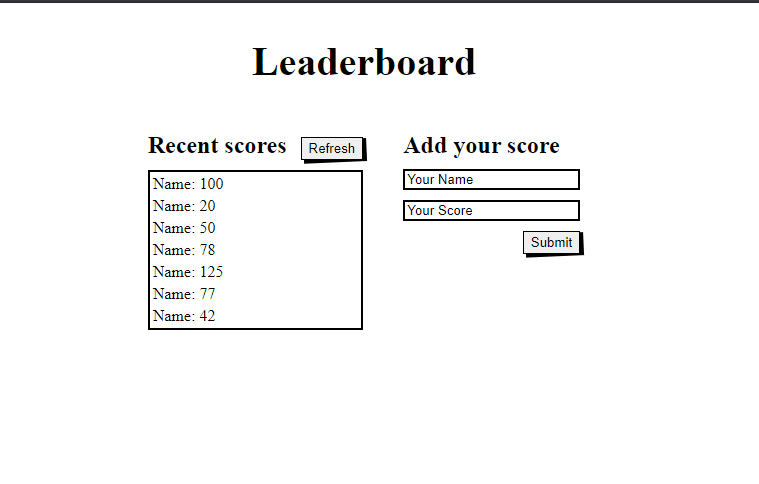

# Leaderboard

> This project is a leaderboard website that displays scores submitted by different players.

### Milestone 1:

- Create gitflow structure
- Create simple HTMl structure
- Add minimal styling
- Use Es6 modules with import/export function

### Milestone 2:

- Create gitflow structure
- Create simple HTMl structure
- Add minimal styling
- Use Es6 modules with import/export function

## Built With
- HTML, SCSS, Bootstrap, Webpack, Javascript  

## Live Demo

[Live Demo Link](https://ghiftee.github.io/Leaderboard/dist/)

## Getting Started

To get a local copy up and running:

You should have basic knowledge of HTML, Webpack, Javascript, a text editor and chrome browser.

You can also clone this repository by simply going to [Repository Link](https://github.com/Ghiftee/leaderboard/) and downloading it.

After downloading:
- Run npm install && npm start.
- Then run npm run build to update dist folder 

## Authors
👤 **Gift Uwhubetine**

- GitHub: [@githubhandle](https://github.com/ghiftee)
- Twitter: [@twitterhandle](https://twitter.com/i_ghiftee)
- LinkedIn: [LinkedIn](https://linkedin.com/in/giftuwhubetine)

## 🤝 Contributing

Contributions, issues, and feature requests are welcome!

Feel free to check the [issues page](../../issues/).

## Show your support

Give a ⭐️ if you like this project!

## 📝 License

This project is [MIT](./MIT.md) licensed.
