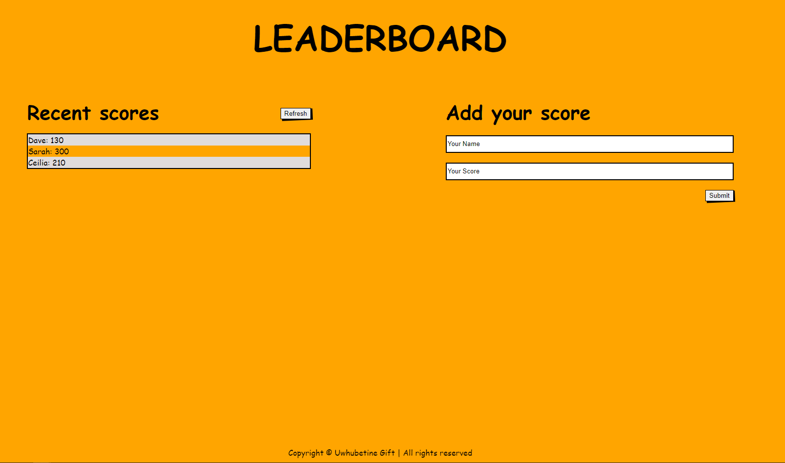

# Leaderboard

> This project is a leaderboard website that displays scores submitted by different players.

### Milestone 1:

- Create gitflow structure
- Create simple HTMl structure
- Add minimal styling
- Use Es6 modules with import/export function

### Milestone 2:

- Use leaderboard API documentation to work with API
- Create a new game using the API.
- Implement refresh button
- Implement submit button
- Use async/await features to consume the API

### Milestone 3:

- Improve look and feel
- Add styling
- Maintain general layout of wireframe

# Built With
- HTML, SCSS, Bootstrap, Webpack, Javascript, leaderboard API

### Interaction with the leaderboard API
- First, add the [base url](https://us-central1-js-capstone-backend.cloudfunctions.net/api/)
- Create a new game. The POST method is used to create a new game and the game must have a name
  e.g
    { 
    "name": "My cool new game" 
    }
  Each created game has a result in the form of a unique ID or key called the gameId
- There are two allowed actions to access the scores, the POST and GET methods
- POST method creates a new score for the given game and it requires that a username and point is first given
- GET method however does not require any input from the user and its function is just to return the list of users and their scores
- Get the gameID then chain it with the base url to get the score.

## More information about interacting with the API can be found in [The Leaderboard API Documentation](https://www.notion.so/Leaderboard-API-service-24c0c3c116974ac49488d4eb0267ade3)

## Live Demo

[Live Demo Link](https://ghiftee.github.io/Leaderboard/dist/)

## Getting Started

To get a local copy up and running:

You should have basic knowledge of HTML, Webpack, Javascript, a text editor and chrome browser. 
You can clone this repository by simply going to [Repository Link](https://github.com/Ghiftee/leaderboard/) and downloading it.

After downloading:
- Run npm install && npm start.
- Then run npm run build to update dist folder

## Authors
👤 **Gift Uwhubetine**

- GitHub: [@githubhandle](https://github.com/ghiftee)
- Twitter: [@twitterhandle](https://twitter.com/i_ghiftee)
- LinkedIn: [LinkedIn](https://linkedin.com/in/giftuwhubetine)

## 🤝 Contributing

Contributions, issues, and feature requests are welcome!

Feel free to check the [issues page](../../issues/).

## Show your support

Give a ⭐️ if you like this project!

## 📝 License

This project is [MIT](./MIT.md) licensed.
